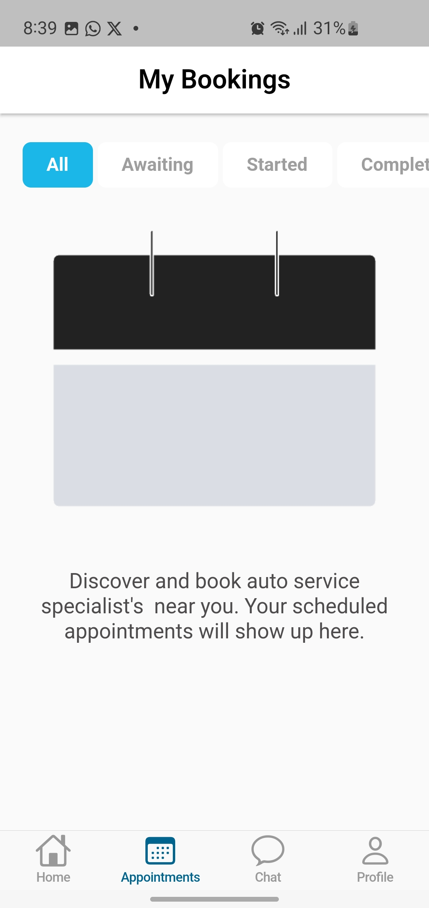

# I’m Kanyanta M. Makasa (@KanyantaM)

Welcome to my GitHub profile! I'm a dedicated software developer with a strong focus on **Flutter**, **Django**, and **machine learning**. I thrive on tackling a wide array of projects, particularly those that drive commercial success and contribute to impactful open-source initiatives aimed at improving people's lives through technology.

## 🚀 About Me

- **Interests:** Mobile app development with **Flutter**, web development using **Django**, and exploring the vast potential of **machine learning**.
- **Continuous Learning:** I am constantly enhancing my skills in **Flutter** and **Kotlin** for app development. Additionally, I have a robust foundation in **C++**, **Python**, and **Matlab**, which I utilize extensively in my role as a power electrical engineer.
- **Collaboration:** I am eager to collaborate on a diverse range of projects, especially those with commercial viability and significant societal impact. Please note that I take on software projects exclusively on a remote basis.
- **Professionalism:** My commitment to hard work and discipline ensures that I am a reliable and valuable contributor to any project I undertake.

## 🛠️ Technologies & Tools

### Currently Learning

## 📱 Mobile Apps I have worked on

---

### Client Projects

---

#### 1. Court Craze (Complete)

A Flutter app with various APIs to perform CRUD operations, allowing users to view live NBA results, standings, team news, and more.

    <table>
        <tr>
            <td><b>Video Updates from official NBA channel</b></td>
            <td><b>Side Bar for easy Navigation</b></td>
            <td><b>Live Score results</b></td>
        </tr>
        <tr>
            <td></td>
            <td></td>
            <td></td>
        </tr>
    </table>

---

#### 2. Garage Finder (Under Development)

An app that allows users to find nearby garages and make appointments for specific timeslots. The app utilizes a Supabase backend.

    <table>
        <tr>
            <td><b>Role Selection Screen</b></td>
            <td><b>User Login</b></td>
            <td><b>Appointment Screen</b></td>
        </tr>
        <tr>
            <td></td>
            <td></td>
            <td></td>
        </tr>
    </table>

---

#### 3. Gene App (Under Development)

An app that utilizes bioinformatics technology to allow users to find particular SNPs or phenotypes within their DNA. One of my favorite projects yet 🧬😁

    <table>
        <tr>
            <td><b>Home View</b></td>
            <td><b>Genetic Info Search History</b></td>
            <td><b>User Profile/Settings</b></td>
        </tr>
        <tr>
            <td></td>
            <td></td>
            <td></td>
        </tr>
    </table>

---

#### 4. Salon Booking App (Completed)

This project allows salon owners to create salons, and customers to make appointments at the salons.

    <table>
        <tr>
            <td><b>Home View</b></td>
            <td><b>Google Map Integration</b></td>
            <td><b>Service Selection</b></td>
        </tr>
        <tr>
            <td></td>
            <td></td>
            <td></td>
        </tr>
        <tr>
            <td><b>Salon Owner Schedule Settings</b></td>
            <td><b>Booking View</b></td>
        </tr>
        <tr>
            <td></td>
            <td></td>
        </tr>
    </table>

---

### Personal Projects

---

These are projects I have built that I feel are cool or solve a problem.

---

#### 1. Local Food Delivery App (Under Development)

This app is intended to compete with my country's main food delivery app, Yango Deli. It uses Flutter flavors to create different app versions under the same code base, BLoC for state management, and a Firebase backend.

    <table>
        <tr>
            <td><b>Active Orders</b></td>
            <td><b>Order History</b></td>
            <td><b>Order Details</b></td>
        </tr>
        <tr>
            <td></td>
            <td></td>
            <td></td>
        </tr>
    </table>

---

#### 2. ReviZa (Completed - Yet to be deployed)

A study material sharing app with a Django Rest Framework backend, BLoC for state management, and Hive for local storage.

    <table>
        <tr>
            <td><b>Home</b></td>
            <td><b>Material</b></td>
            <td><b>Downloads</b></td>
        </tr>
        <tr>
            <td></td>
            <td></td>
            <td></td>
        </tr>
        <tr>
            <td><b>Upload Material</b></td>
            <td><b>Search Courses</b></td>
        </tr>
        <tr>
            <td></td>
            <td></td>
        </tr>
    </table>

---

## 📊 GitHub Stats

  
  
  

## 🔗 Connect with Me

  
  
  

<!---
KanyantaM/KanyantaM is a ✨ special ✨ repository because its `README.md` (this file) appears on your GitHub profile.
You can click the Preview link to take a look at your changes.
--->
